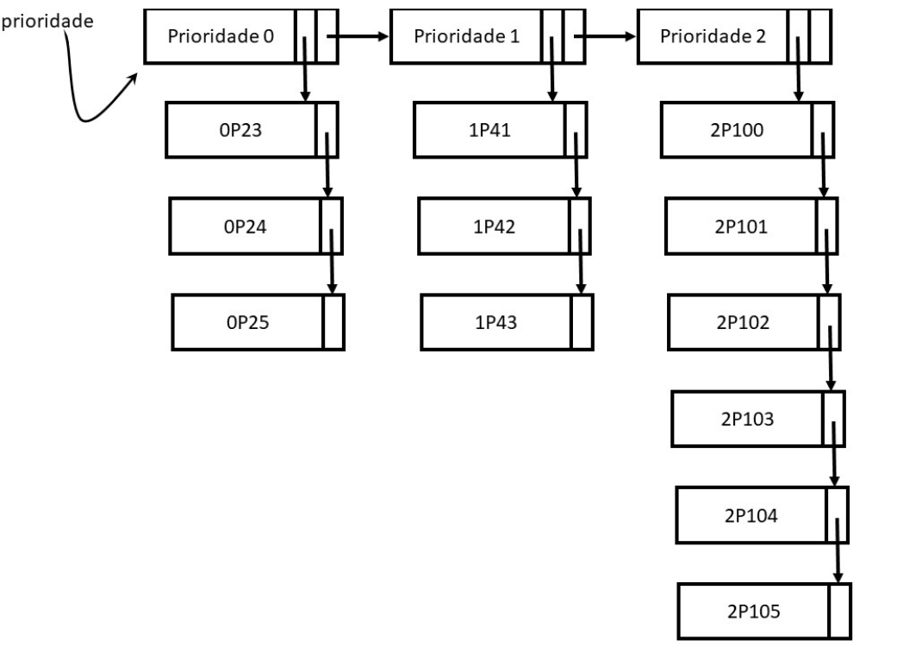

# Trabalho 1 - Sistemas Operacionais - UFSC - INE6511-04238A/B(20182)

`Rodrigo Chaves`  
`Rodolfo Dartora`  

```
Compilando: gcc main.c -pthread
Executando: ./a.out qtdGuiches #onde qtdGuiches é um inteiro maior que zero
```


## Descrição do Problema
O objetivo deste trabalho é o estudante aplicar os conceitos de pthreads, exclusão mútua e escalonamento de tarefas por meio de uma simulação de um sistema de gerenciamento de atendimento.

Numa repartição, os cidadãos são atendidos por ordem de prioridade. Existem 3 prioridades: 0 (a mais alta), 1 (média) e 2 (a mais baixa).

Dentro da prioridade, o atendimento obedece à política FIFO. A princípio, um cidadão na fila de prioridade 1 será atendido apenas quando a fila de prioridade 0 estiver vazia; um cidadão na fila de prioridade 2 será atendido apenas quando as fila de prioridade 1 e 0 estiverem vazias. Dessa forma, cidadãos nas filas 1 e 2 poderiam ficar esperando indefinidamente para serem atendidos, sofrendo, assim, de starvation. Para evitar isso, o sistema de gerência das filas aplica um algoritmo de envelhecimento (aging): a cada 3 cidadãos da fila 0 atendidos em sequência, o cidadão que está a mais tempo na fila 1 passa para a fila 0; a cada 3 cidadãos da fila 1 atendidos em sequência, incluindo aqueles que foram "promovidos", o cidadão que está a mais tempo na fila 2 passa para a fila 1. 

### Objetivo do trabalho
O objetivo deste trabalho é implementar um programa na linguagem C que faça o gerenciamento das filas conforme descrito acima. As filas deverão ser implementadas na forma de uma multilista conforme a figura abaixo:  
  
Somente o apontador para a fila principal deverá ser mantido. 

Também deverá ser implementado um simulador para testar o sistema de gerência de filas.  O simulador cria N threads guichês, onde N é um inteiro lido quando da carga do sistema. Um criador de cidadãos cria de tempos em tempos cidadãos representados. Um cidadão pode ser simplesmente um nó contendo a identificação composta pelo número de sua prioridade (0P, 1P, 2P), definida aleatoriamente pelo simulador, e um número sequencial indicando a ordem do cidadão daquela prioridade, conforme a figura acima. Por exemplo, 2P104 é a 104º cidadão de prioridade 2 do dia. 

Quando uma thread guichê está livre, ela desenfileira algum cidadão seguindo a política definida no início do enunciado. Após, ela gera um atraso - o tempo para atender o cidadão. 

### Método
Conforme dito, a implementação deve ser realizada na linguagem C em qualquer ambiente.

### Grupos, Avaliação e Entrega
O trabalho deverá ser realizado em grupos de até 3 estudantes. Os estudantes serão responsáveis por formar os grupos com auxilio da ferramenta Escolha de Grupos - Trabalho 2 (T2) disponível no Moodle. Um dos integrantes de cada grupo deverá submeter, via Moodle, um arquivo contendo o código fonte em C contendo a solução do trabalho. A data/hora limite para o envio dos trabalhos é 21/10/2018 às 23h55min. Não será permitida a entrega de trabalhos fora desse prazo: trabalhos não enviados no prazo receberão nota zero. Após a data limite para entrega, os alunos deverão agendar a apresentação do trabalho com professor. O professor irá avaliar não somente a corretude mas também o desempenho e a clareza da solução. Além disso, os estudantes serão avaliados pela apresentação e entendimento do trabalho. A implementação e apresentação valerão 40% e 60% da nota do trabalho, respectivamente. Na apresentação, o professor questionará individualmente cada componente do grupo sobre aspectos das estratégias utilizadas e sobres aspectos de código da implementação. 

